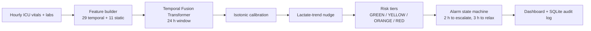

**VIGIL: Sepsis Early-Warning System**


# 🩺 VIGIL: Sepsis Early-Warning Research Prototype

     

VIGIL reads the last 24 hours of an ICU patient's vitals and labs, plus background such as age, and estimates every hour the risk that organ dysfunction will start within the next 6 hours. Alerts are rate-limited to avoid alarm fatigue, and every alert change is written to an audit log.

It is a **retrospective research prototype**, built to be tested honestly on data it never saw during training. It has not been used on live patients.

---

## 🎯 The Problem

Sepsis is organ failure triggered by infection. The standard bedside screen, **SIRS**, ticks 4 boxes (temperature, heart rate, breathing rate, white-cell count) and alarms at 2. It works for obvious cases but can stay silent when organs such as the kidneys worsen while the white count and vitals look normal.

**Question:** can the trend of the last 24 hours flag these patients, including those with a normal white count (4 to 12), without flooding staff with false alarms?

---

## 📊 Results (retrospective)


| Measure | Result |
|---|---|
| External ranking (AUROC), 6-hour organ-dysfunction proxy | **0.852** (95% CI 0.8505 to 0.8538) |
| Precision-recall (AUPRC) at assumed 3% prevalence | 0.150 (5.0x chance) |
| Cases flagged, VIGIL vs SIRS | **83.7% vs 51.9%** |
| Cases with normal white count (4 to 12) | **83.0% vs 35.8%** |
| False alarms on the same 3,467 controls | 25.6% vs 34.9% |
| Hospital-death cross-check (never trained on) | AUROC 0.726; mortality 2.3% in the lowest-risk quarter vs 19.7% in the highest |
| Across 174 hospitals with enough deaths | median AUROC 0.725, range 0.526 to 0.880 |
| Calibration (internal MIMIC test) | Brier 0.1225 to 0.1030; ECE 0.093 to 0.009 |

**Other comparison scores** (same patients, hours and "2 hours in a row" rule; no mental-status or oxygen-use data was available, so these are partial versions):

| Score | Cases flagged | False alarms | VIGIL at the same false-alarm rate |
|---|---|---|---|
| SIRS (2 or more criteria) | 51.9% | 34.9% | 86.4% |
| NEWS2, partial (5 or more) | 35.1% | 18.1% | 79.7% |
| NEWS2, partial (7 or more) | 12.9% | 4.3% | 54.7% |
| qSOFA, modified | 9.1% | 4.2% | 51.8% |

The alert test uses 11,161 proxy-defined cases and 3,467 controls drawn from the external dataset. VIGIL's threshold (0.30, two hours in a row) was fixed before testing; the matched-false-alarm thresholds were chosen afterwards.

> **How to read this.** VIGIL was trained to forecast this exact organ-dysfunction proxy and the other scores were not, so the comparison shows how well each score anticipates the proxy, not clinical benefit. Warning time was **not** better than SIRS.

---

## 🏗️ How It Works



| Layer | Job | Status |
|---|---|---|
| **TFT** | Main risk score. Drives the tier and the alert. | Externally evaluated |
| Rebound GRU | Flags "looks better, then worsens" patterns (AUROC 0.78 internal). | Exploratory, context only |
| Lactate trend | Rule on the last two real lactate draws. Says "insufficient data" when it cannot assess. | Heuristic, context only |
| Fluid response (XGBoost) | Experimental blood-pressure response (AUROC 0.67). | Experimental, not validated |

**Inputs.** Temporal: heart rate, respiratory rate, blood pressure, SpO2, lactate, WBC, creatinine, temperature, plus derived trends and three "divergence" features (organ markers worsening while WBC falls). Static: age, gender, emergency admission, community-acquired, six comorbidity flags, baseline creatinine.

**Alert rule.** Risk of 0.30 or more for 2 hours in a row, scored only after 24 hours of history (no zero-padding). The state machine turned 8 raw tier changes into 2 on the test cohort.

---

## 🗄️ Data

| Dataset | Use | Scale |
|---|---|---|
| MIMIC-IV | Training and internal tests | 91,791 ICU stays, 7.2M hourly rows (62,417 train / 11,015 val / 18,359 test) |
| eICU-CRD v2.0 | External evaluation only, never tuned on | 197,136 stays harmonised, 208 hospitals |

The external runs fill only three static features (age, gender, baseline creatinine). Comorbidity and admission flags are zero in eICU.

**Label.** A three-part proxy: creatinine above 1.2, mean arterial pressure below 70, lactate above 2, with 2 or more present. It is not confirmed Sepsis-3 and its parts are also model inputs.

---

## 🔍 Data Quality Audits

Four problems were found and corrected. The lower numbers were kept.

| Problem | Effect | Fix |
|---|---|---|
| Label leakage (timestamp misalignment) | Internal AUROC 0.98 | Strict 6-hour gap, honest AUROC about 0.91 |
| Zero-padded short histories | Lead time inflated to 24 h | Score only from hour 24; corrected median lead 15 h; 573 patients with no scorable hour excluded |
| Missing WBC counted as "quiet" | Fake cryptic-vs-overt deficit | Re-split on measured WBC only |
| Mismatched control groups in the SIRS false-alarm comparison | SIRS false alarms understated (26.7%) | Same 3,467 controls for both (SIRS 34.9%) |

Two further checks on the alert results: among patients with no alert at the first scorable hour, VIGIL raised a new alert for 83.3% vs 43.0% for SIRS (n=1,264, a subset); and 52% of all VIGIL alerts fired at exactly hour 24, so lead time is partly bounded by when scoring starts.

---

## 🚀 Run Locally

The demo uses **four synthetic patients** (SYN-01 to SYN-04), generated from physiology rules. No real patient data is in this repository.

> The trained model bundle `VIGIL_DEPLOY_v1.pt` is not in this repository yet. A hosted demo is planned.

```
pip install -r vigil_requirements.txt
uvicorn main:app --port 8000
```

Then open http://localhost:8000. On Windows, `run.bat` does the same.

| Environment variable | Default | Purpose |
|---|---|---|
| `VIGIL_BUNDLE` | `VIGIL_DEPLOY_v1.pt` | Model bundle (TFT, calibrator, tiers) |
| `VIGIL_COHORT` | `synthetic_cohort.json` | Patients to replay |
| `VIGIL_TICK` | `3` | Real seconds per simulated clinical hour |
| `VIGIL_DB` | `vigil_events.db` | SQLite audit log |


---

## 🔌 API

| Endpoint | Purpose |
|---|---|
| `GET /` | Dashboard |
| `GET /api/patients` | Ward board, sorted by risk |
| `GET /api/patients/{id}` | One patient with full risk history and alert transitions |
| `POST /api/patients/{id}/acknowledge` | Silence an alarm until the patient worsens |
| `GET /api/model-card` | Metrics, tiers, intended use, limitations |
| `GET /api/audit` | Recent tier changes with hour and reason |
| `WS /ws` | Live updates |

---

## 📁 Repository Map

| File | Role |
|---|---|
| `main.py` | FastAPI server, clock, WebSocket, audit log |
| `vitals_source.py` | Releases one clinical hour per patient, keeps a 32-hour buffer |
| `features.py` | Builds model inputs; checked against the training pipeline (max error about 5e-7) |
| `inference.py` | Model stack, calibration, lactate tracker |
| `alarms.py` | Alarm state machine (hysteresis, acknowledge) |
| `dashboard.html` | Live ward board |
| `make_synthetic_cohort.py`, `synthetic_cohort.json` | Synthetic demo patients |
| `check_cohort.py` | Cohort sanity checks |

---

## ⚠️ Limitations

1. **Retrospective only.** No prospective or live-hospital testing.
2. **Proxy label.** Not confirmed Sepsis-3; no infection check in the external set; its components are also inputs. The hospital-death check (AUROC 0.726) was added to test for circularity.
3. **Trained on the proxy.** Comparison scores were not, so results measure proxy anticipation, not clinical benefit.
4. **About 9 in 10 hourly alerts are false** at the operating point (hourly precision about 9%).
5. **Needs 24 hours of history.** Patients who deteriorate on day one get reduced or no warning.
6. **Not earlier than SIRS.** Among patients both flagged, VIGIL was earlier in only 28%.
7. **Partial comparators.** qSOFA and NEWS2 ran without mental-status and oxygen-use data.
8. **Observation time.** Controls were observed for a median 7 h vs 16 h for cases, so false-alarm rates are lower bounds.
9. **Calibration.** Weakest at 0.3 to 0.4 (about 5 points optimistic); eICU scores were not recalibrated.
10. **Research demonstration, not a medical device.** Not for clinical decisions.

---

## 🗺️ Roadmap

- Per-hospital sepsis results (currently shown for the death check)
- Infection-aware or clinician-reviewed outcome definition
- Complete NEWS2 and qSOFA comparators
- Hosted public demo
- Prospective silent evaluation (needs a clinical partner)

---

## 🔐 Data Access and Ethics

MIMIC-IV and eICU-CRD require PhysioNet credentialing and a data use agreement. No patient-level data from either is included here. The real-patient replay file is excluded under the PhysioNet data use terms.

---

## 📚 References

1. Johnson et al. MIMIC-IV, PhysioNet. https://mimic.mit.edu
2. Pollard et al. eICU Collaborative Research Database. https://eicu-crd.mit.edu
3. Lim et al. Temporal Fusion Transformers for interpretable multi-horizon time-series forecasting. *Int. J. Forecasting*, 2021.
4. Singer et al. Third International Consensus Definitions for Sepsis (Sepsis-3). *JAMA*, 2016.

**Contact:** vsananya02@gmail.com | **LinkedIn:** ( https://www.linkedin.com/in/v-s-ananya-21b32a28a/ ) | **Portfolio:** ( https://ananya-systems-and-intelligence.vsananya0205.chatgpt.site/ )

*VIGIL: a sepsis early-warning prototype, built to be inspected.*

